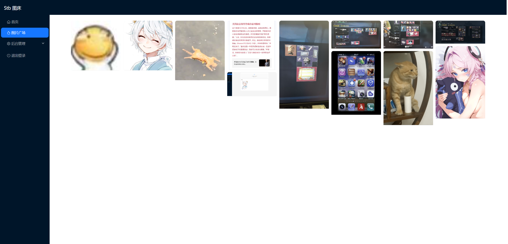
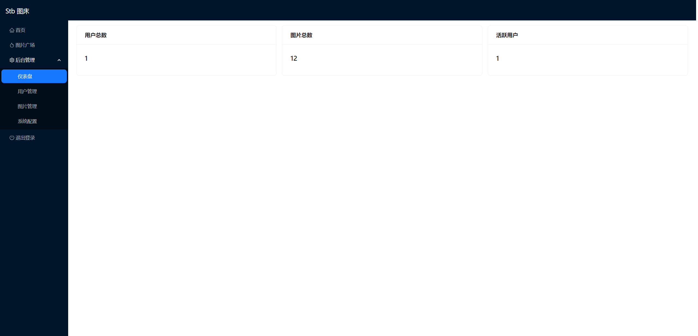
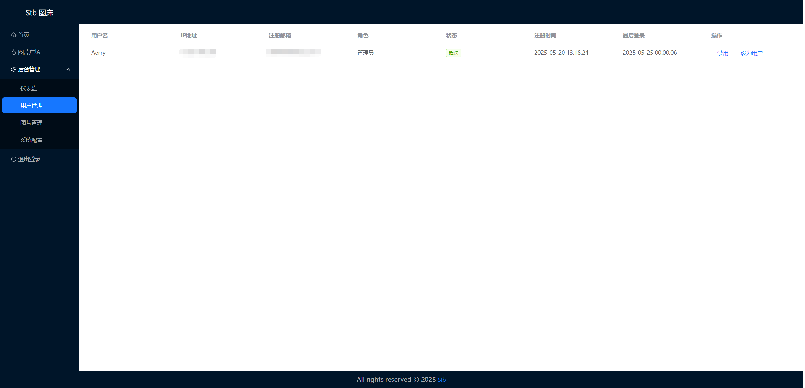
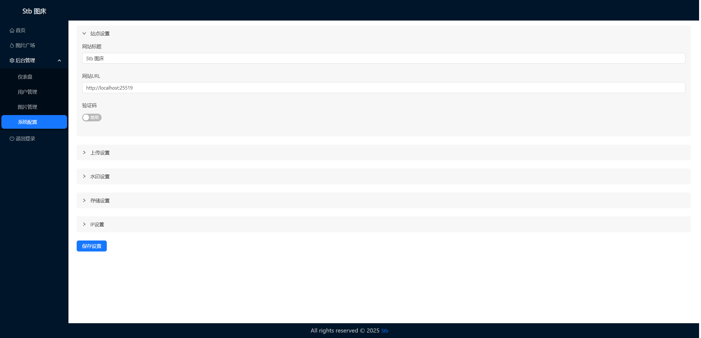
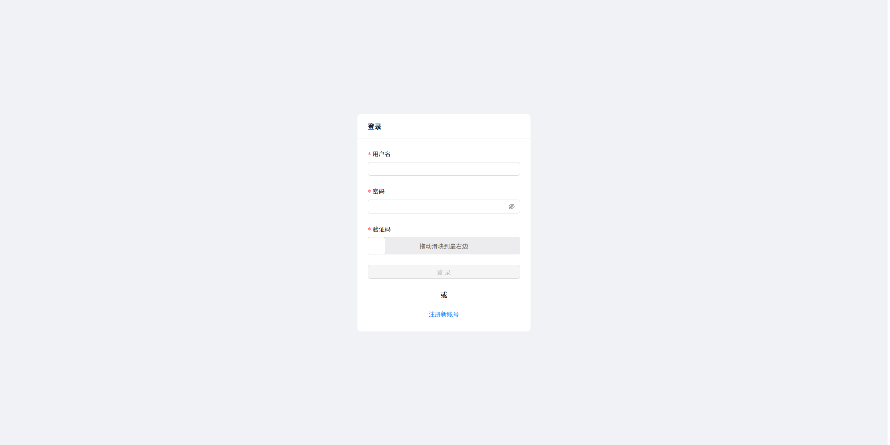
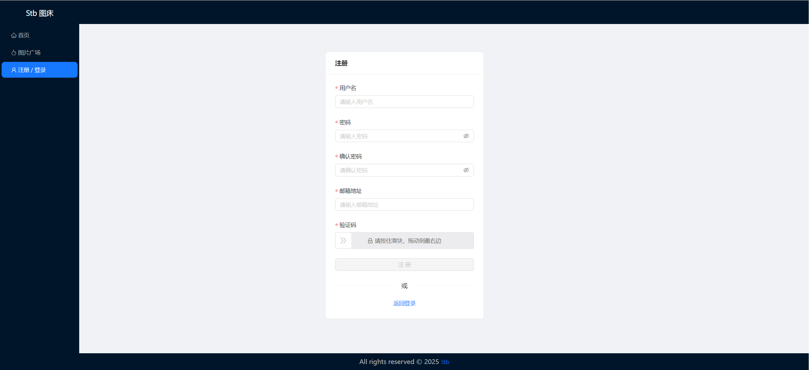

# Stb图床

[安装图床](/docs/安装图床.md) • [界面展示](#界面展示) • [星标趋势](#星标趋势) • [开源协议](#开源协议)

## 特点
* [x] 支持设置图片质量
* [x] 支持压缩图片大小
* [x] 支持文字/图片水印
* [x] 支持设置图片指定宽/高
* [x] 支持上传图片转换为指定格式
* [x] 支持限制最低宽度/高度上传
* [x] 支持上传其他文件格式
* [x] 在线管理图片

## 界面展示
 
 
 
 
 
 
 
 

## 星标趋势

如果你觉得 Stb 对你有帮助，欢迎点击右上角 ⭐Star 支持我们，让更多人了解和使用这个项目。

## 开源协议

Stb 遵循 [Apache-2.0](https://opensource.org/license/apache-2-0) 协议进行分发和使用，更多详情请参见[协议文件](/LICENSE)。