<div align="center">

# Stb 图床 - 现代化图片托管解决方案

[](https://github.com/setube/stb/stargazers)
[](https://github.com/setube/stb/network/members)
[](/LICENSE)

[安装图床](https://github.com/setube/stb/wiki/install) • [界面展示](#界面展示) • [星标趋势](#星标趋势) • [开源协议](#开源协议)

</div>

> [!TIP]\
> 如果上传者的 IP 获取不准确, 请在 Nginx 配置文件中添加以下配置
>
> ```nginx
> proxy_set_header X-Forwarded-For $proxy_add_x_forwarded_for;
> proxy_set_header X-Real-IP $remote_addr;
> ```

## 特点

- [x] 支持图片广场、广场开关
- [x] 支持设置图片质量
- [x] 支持压缩图片大小
- [x] 支持文字、图片水印
- [x] 支持设置图片指定宽、高
- [x] 支持上传图片转换为指定格式
- [x] 支持限制最低宽度、高度上传
- [x] 支持游客上传
- [x] 支持关闭注册、邀请码注册
- [x] 支持图片缩略图
- [x] 支持网站统计
- [x] 支持上传第三方存储
- [x] 支持图片鉴黄
- [x] 支持查看上传日志
- [x] 支持上传 IP 黑名单
- [x] 支持限制日上传次数
- [x] 支持管理、创建、修改、删除相册
- [x] 支持通过接口上传、管理图片、管理全站
- [x] 支持第三方社会化登录

## 已支持以下第三方存储

- [x] Telegram
- [x] Github
- [x] 阿里云 OSS
- [x] 腾讯云 COS
- [x] AWS S3
- [x] Cloudflare R2
- [x] 七牛云 Kodo
- [x] 又拍云 USS
- [x] SFTP
- [x] FTP
- [x] WebDAV

## 界面展示


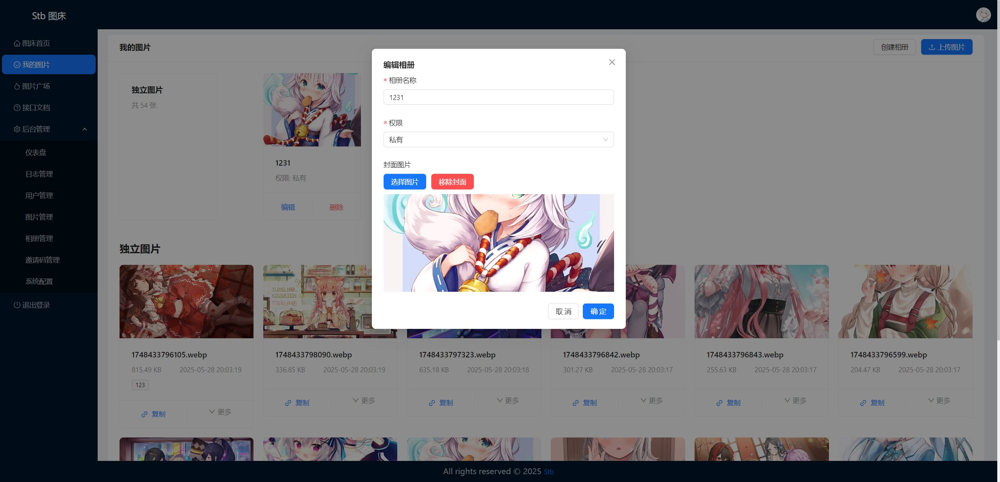
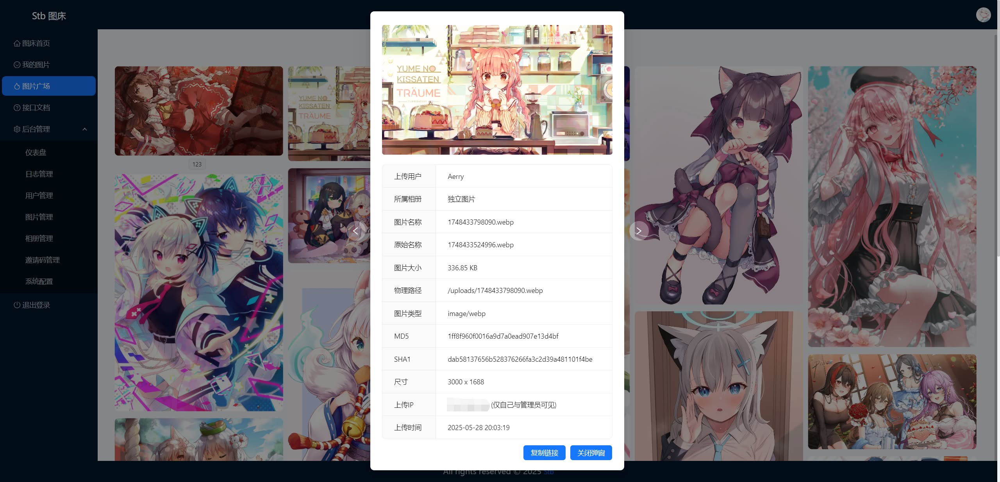
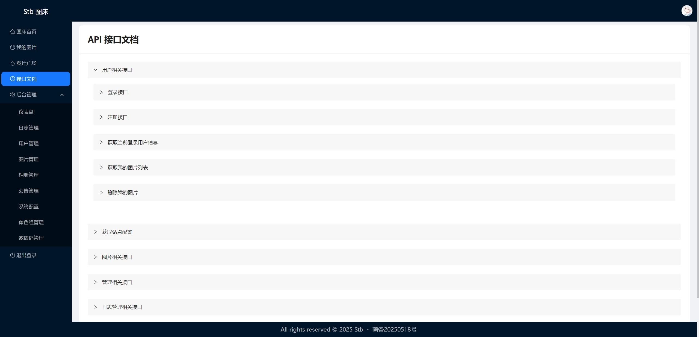
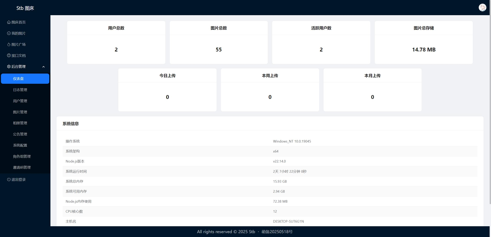
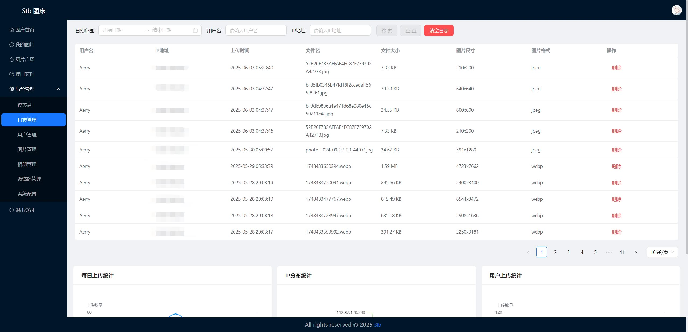
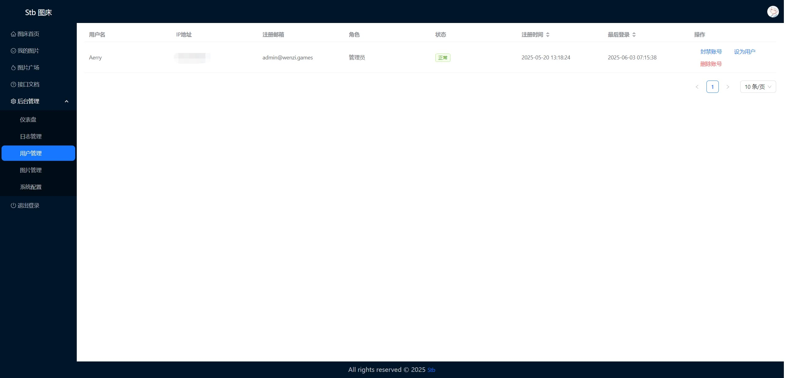
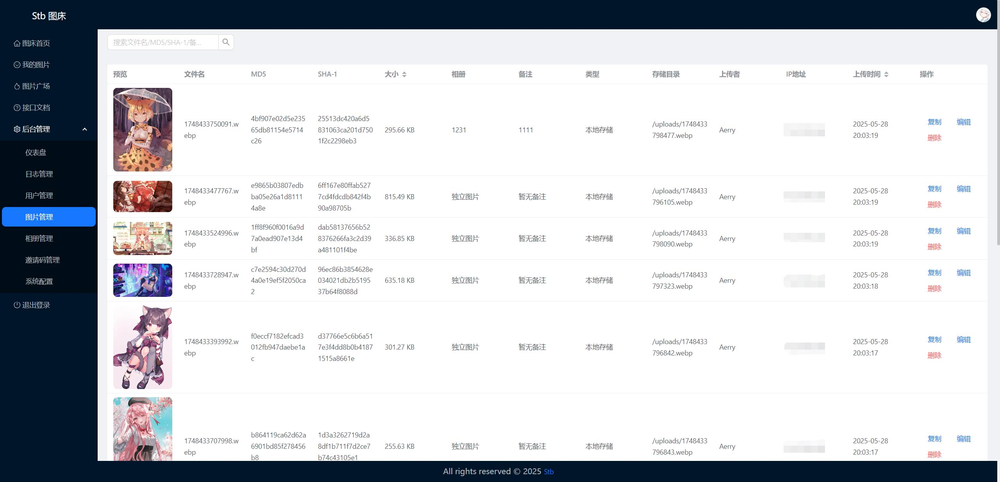
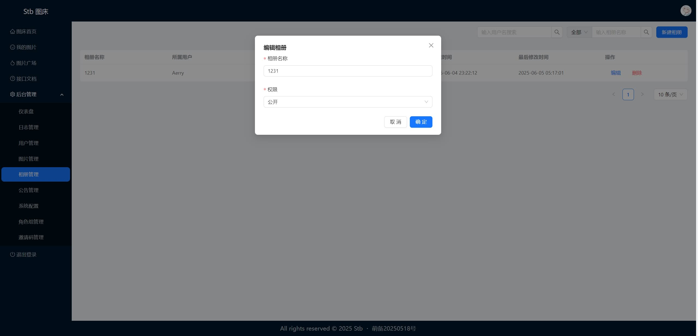
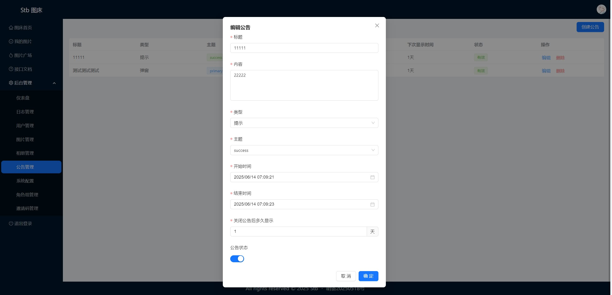

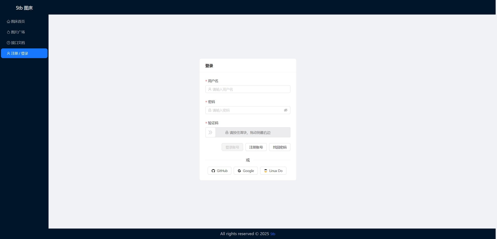
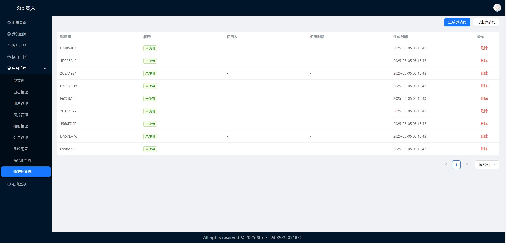
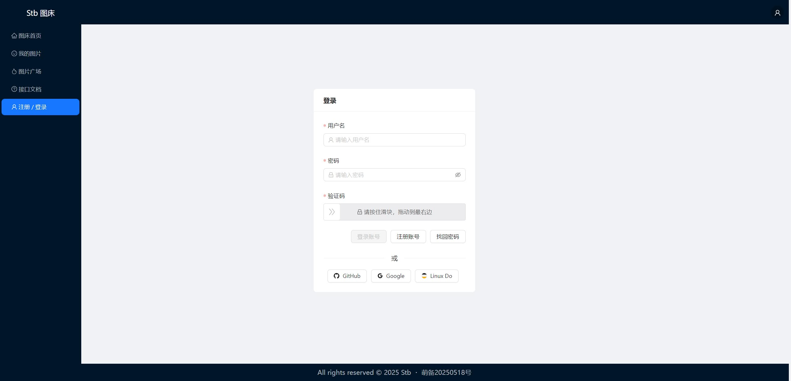
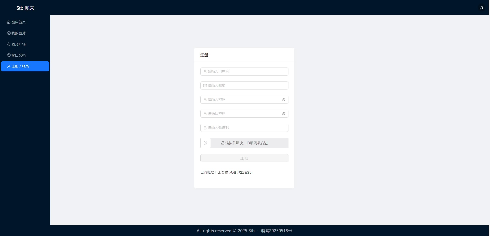
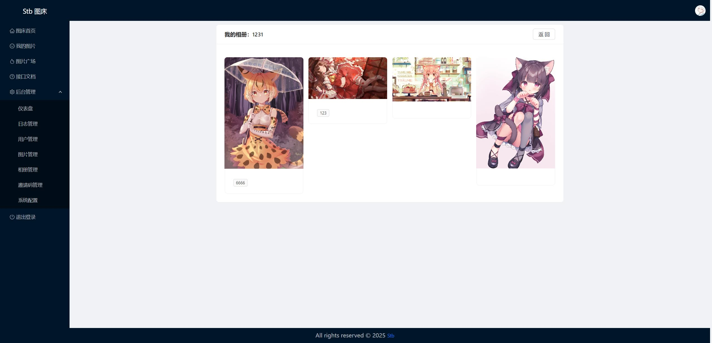
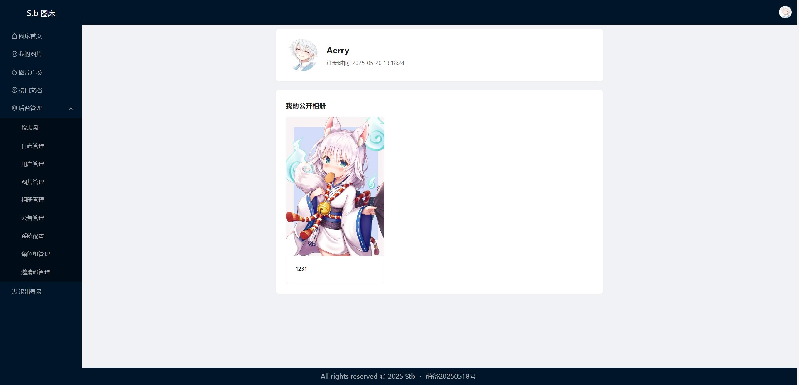

## 星标趋势

如果你觉得 Stb 对你有帮助，欢迎点击右上角 ⭐Star 支持我们，让更多人了解和使用这个项目。


## 开源协议

Stb 遵循 [Apache-2.0](https://opensource.org/license/apache-2-0) 协议进行分发和使用，更多详情请参见[协议文件](/LICENSE)。
